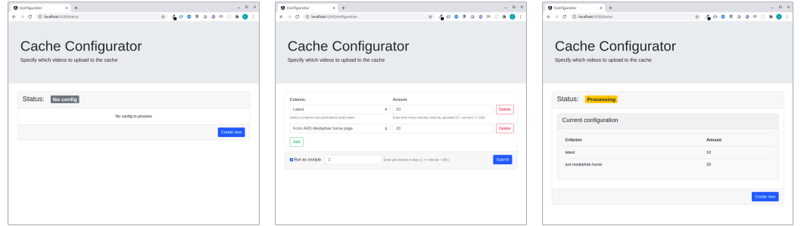

| [](https://www.5g-victori-project.eu/) | This project has received funding from the European Union’s Horizon 2020 research and innovation programme under grant agreement No 857201. The European Commission assumes no responsibility for any content of this repository. | [](https://ec.europa.eu/programmes/horizon2020/en) |
| ---------------------------------------------------------------------------------------- | ------------------------------------------------------------------------------------------------------------------------------------------- | ----------------------------------------------------------------------------------------------------------------------------------------------------------------------------------------------------------------------------------------- |


# Configurator UI

User interface to run in Web browsers to specifiy a subset of media items from a content catalogue.

## What is this?

The Configurator UI service is part of the [platform](../../../5gv-platform) for media caching on trains. It allows editorial staff of a VoD service provider defining a set of rules to determine a subset of media items to be uploaded to the media cache on the train. A rule consists of a criterion and a number. The criterion can be selected from a drop-down menu. At the moment, the criteria: "latest clips" and "clips linked on the VoD portal" homepage are supported. The number is entered via a text input field and determines how many videos that meet this criterion should be loaded into the cache. Also the configurator provides a status display which shows the current configuration and the current processing status.



## How does it work?

The below diagram shows the software modules that make up the Configurator UI. The Status Display which is implemented by the [`status-display.component.ts`](src/app/status-display/status-display.component.ts) shows the current configuration and the current progress of the cache prefilling process. The current configuration is requested through the [State API](../../../5gv-state-api)'s REST interface. Cache state updates are received through the State API's event gateway. The Configuration Form is implemented by the [`status-display.component.ts`](src/app/configuration/configuration.component.ts). It sends user input to REST interface of the State API.


## Technology used

- [Angular.js](https://angular.io/)
- [ngBootstrap](https://ng-bootstrap.github.io/#/home)

## Install, build, run

**Note:** _Typically you would use the `up.sh` script from the [Platform](../../../5gv-platform) project to install, build and run this app as part of a composite of docker services. Read on if you intend to run the service directly on your host system._

**Prerequestits**: Following software needs to be installed on your host machine in order to execute the subsequent steps.

- [Node.js](https://nodejs.org/en/)
- [NPM](https://www.npmjs.com/)

**Development server**:

Run `ng serve` for a dev server. Navigate to `http://localhost:4200/`. The app will automatically reload if you change any of the source files.

**Production Build**:

Run `ng build` to build the project. The build artifacts will be stored in the `dist/` directory. Use the `--prod` flag for a production build.

**Docker image**:

With following command you can build a [docker image](https://www.docker.com) for this service. But again, typically you use the startup script `up.sh` of the [Platform](../../../5gv-platform) project to do the job.

```bash
$ DOCKER_BUILDKIT=1 docker build --ssh gitlab="$HOME/.ssh/<<your_private_key_name>>" -t configurator-ui .
```

Replace `<<your_private_key_name>>` by the name of the private key used to authenticate at the repository.

**Web server**:

In the current version the service uses Angular's development server to serve the website to clients. This is not recommended and may impose security and performance issues. In production a production level web server like [NGINX](https://www.nginx.com/) or [Apache](https://httpd.apache.org/) should be used to serve an Angular production build.
